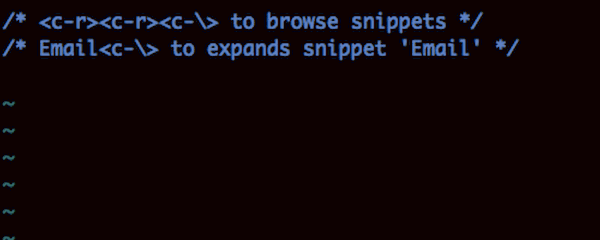
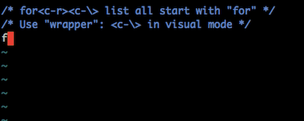
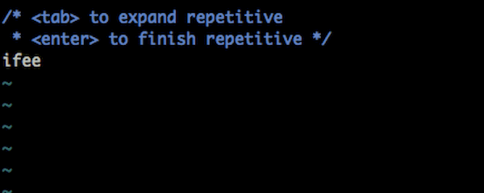
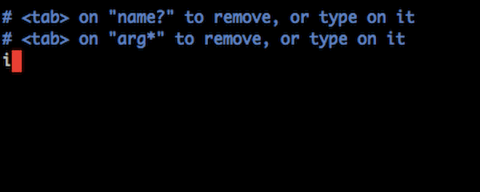
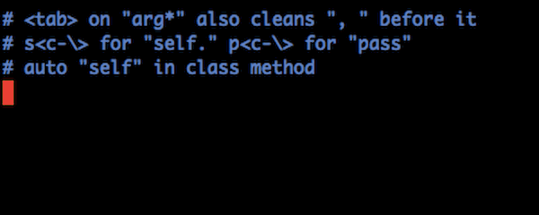
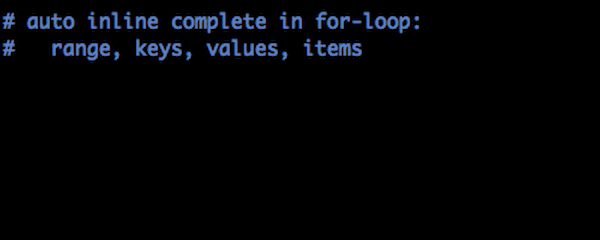
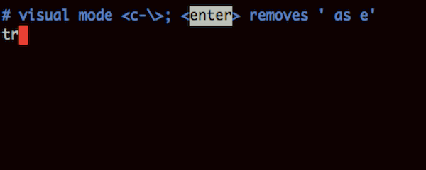
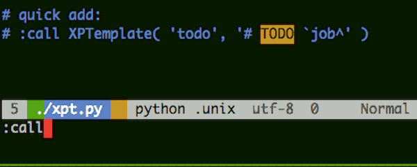
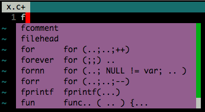

<!-- START doctoc generated TOC please keep comment here to allow auto update -->
<!-- DON'T EDIT THIS SECTION, INSTEAD RE-RUN doctoc TO UPDATE -->
**Table of Contents**  *generated with [DocToc](http://doctoc.herokuapp.com/)*

- [XPTemplate](#xptemplate)
  - [Usage](#usage)
    - [Browse and basic usage](#browse-and-basic-usage)
    - [C skeleton](#c-skeleton)
    - [C macro](#c-macro)
    - [C for loop and wrapper](#c-for-loop-and-wrapper)
    - [C if-else-else](#c-if-else-else)
    - [Python option argument](#python-option-argument)
    - [Python def and def in class](#python-def-and-def-in-class)
    - [Python inline completion](#python-inline-completion)
    - [Python try-except can be a wrapper](#python-try-except-can-be-a-wrapper)
    - [Python quickly add snippet](#python-quickly-add-snippet)
    - [Video tutorial](#video-tutorial)
  - [Stay up-to-date](#stay-up-to-date)
  - [About branches](#about-branches)
  - [Features](#features)
- [FAQ](#faq)
  - [Trouble Shooting. Why not work?](#trouble-shooting-why-not-work)
  - [What else does xptemlate required to work](#what-else-does-xptemlate-required-to-work)
  - [How to install](#how-to-install)
  - [Customizing snippet loading](#customizing-snippet-loading)
  - [How to reload snippets, after I changes snippet definition files(*.xpt.vim)?](#how-to-reload-snippets-after-i-changes-snippet-definition-filesxptvim)
  - [Do NOT like spaces in auto-completed brackets/braces](#do-not-like-spaces-in-auto-completed-bracketsbraces)
  - [I need spaces in brackets/braces only for this language, not that](#i-need-spaces-in-bracketsbraces-only-for-this-language-not-that)
  - [I do not want XPTemplate to auto-complete braces](#i-do-not-want-xptemplate-to-auto-complete-braces)
  - [Adjust space and line-break](#adjust-space-and-line-break)
  - [Adjust format style of c functions, such as `main()`](#adjust-format-style-of-c-functions-such-as-main)
  - [Supertab support](#supertab-support)
  - [With popup menu opened, `<TAB>` doesn't trigger Snippe](#with-popup-menu-opened-tab-doesnt-trigger-snippe)
  - [Set up personal info. XPTemplate complains: "author is not set .."](#set-up-personal-info-xptemplate-complains-author-is-not-set-)
  - [Browse snippets: Pop up menu, Drop down list](#browse-snippets-pop-up-menu-drop-down-list)
  - [Extend XPTemplate. Write new snippets](#extend-xptemplate-write-new-snippets)
  - [Example of repetition snippet.](#example-of-repetition-snippet)
  - [Define repetition trigger place holder](#define-repetition-trigger-place-holder)
- [Known Issues](#known-issues)

<!-- END doctoc generated TOC please keep comment here to allow auto update -->


# XPTemplate

Code snippets engine for Vim, And snippets library.
Write codes in a smooth, quick and comfortable way.
[xptemplate-vim.org][xpt-vim]

<iframe src="http://ghbtns.com/github-btn.html?user=drmingdrmer&repo=xptemplate&type=watch&count=true"
  allowtransparency="true" frameborder="0" scrolling="0" width="110" height="20"></iframe>


## Usage

    >vim xpt.c
    for<C-\>

generates:

    for (i = 0; i < len; ++i){
        /* cursor */
    }

Press `<tab>`,`<tab>`.. to navigate through "i", "0", "len" and finally stop at "`/* cursor */`"


### Browse and basic usage


### C skeleton


### C macro


### C for loop and wrapper


### C if-else-else



### Python option argument


### Python def and def in class


### Python inline completion


### Python try-except can be a wrapper


### Python quickly add snippet



### Video tutorial

Tutorial by Derek Wyatt :
<http://vimeo.com/4449258>


## Stay up-to-date

There are two major branches: "master" and "dev".

* "master" is compacted, logging-removed version.
Always use branch "master" unless you know what you are doing.
* "dev" is for development, that it contains debug statements thus it is a bit slow.


Before 2014-06-01, The two major branches are: "master" and "dist":

* "master" is for developing purpose.
* "dist" is for end user.


## About branches

* Branch `master` is the branch for end user.

* Branch `dev` is for doing further developing on top of
XPTemplate.

* Branches that starts with `f.` are feature branches for different sub system
of XPTemplate.

* Branches that starts with `fd.` are feature breanches that has not yet been
merged into `dev` and `master`, which are NOT considered stable.

* Branches that starts with `snp.` are snippet branches.


## Features

* Live update while typing.
* Navigate forward and backward with `<Tab>` and `<S-Tab>`.
* Support embedded language like JAVASCRIPT in HTML. Or HTML in PHP.
* Wrapper snippet.
* Inclusion.
* Generate dynamic content with variables/functions.
* code style customization: line break before "{".
* Filters.


# FAQ

## Trouble Shooting. Why not work?

First of all, Enter VIM.

* Check setting "compatible". In VIM, type:

        :set compatible?

    Make sure you get *"nocompatible"*. Or you need the following statement in your .vimrc:

        set nocompatible

* Check setting "filetype". In VIM, type:

        :filetype

    Make sure you get *"filetype detection:ON  plugin:ON ..."*. Or you need the following statement in you .vimrc:

        filetype plugin  on


* Check if XPTemplate is loaded. In VIM, type:

        :scriptnames

    You will get a list of scripts VIM has loaded. There should be some files with name started with "xpt", like this:

        97: /data/.../dist/plugin/xptemplate.vim
        98: /data/.../dist/plugin/xptemplate.conf.vim
        99: /data/.../dist/plugin/xptemplate.util.vim

    If not, you should check if you have XPTemplate installed correctly.

    You should see files with name started with "xpt.." in folder ~/.vim/ (Unix-like OS) or in $VIMH/vimfiles/ (Windows). Like this:

        |-- plugin
        ...
        |   |-- xpopup.vim
        |   |-- xpreplace.vim
        |   |-- xptemplate.conf.vim
        ...

    Reference:

        :help 'runtimepath'

* Check key binding. Make sure you have a clear environment:
none of XPTemplate settings like *"let g:xpt..."* in you .vimrc file.
In VIM, type:

        :imap <C-\>

    You will get something like this:

        i  <C-\>       * <C-R>=XPTemplateStart(0,{'k':'<C-\++'})<CR>

    This means your XPTemplate should work well.
    Or check if some other plugin has conflicting key-binding.
    If so, solve it by adding the following statement into you .vimrc file to change XPTemplate key-binding:

        let g:xptemplate_key = '<Tab>'

* Now type in *insert-mode*:

        Date<C-\>

    You will get current date.


## What else does xptemlate required to work

VIM and nothing else!

XPTemplate is implemented purely with VIM script.
Nothing else(like python) is required but a single VIM( at least 7.2 ).

XPTemplate works also in VIM 7.0 too. But it's no as good as in VIM 7.2.


## How to install

Copy all folders in to your ~/.vim folder(on unix-like OS)

Or add path to XPTemplate to VIM setting 'runtimepath'.


## Customizing snippet loading

To load your own snippets and *NOT* to load snippets supplied by XPTemplate,
add this line to your `.vimrc`:
```
let g:xptemplate_lib_filter = '/my_snippets/'
```

Snippets from folder `~/xpt/` that does not match `g:xptemplate_lib_filter`
will not be loaded.

```
~/xpt/ftplugin/c/c.xpt.vim
...
~/my_snippets/ftplugin/c/c.xpt.vim
...
```


## How to reload snippets, after I changes snippet definition files(*.xpt.vim)?

    :XPTreload


## Do NOT like spaces in auto-completed brackets/braces

Spaces inside auto-completed brackets are controlled by XPTemplate variable $SParg.

The Simplest way to disable spaces globally is to add following statements to .vimrc:

    let g:xptemplate_vars = "SParg="


With this setting, `"("` results in `"()"` but not `"(  )"` by default.


## I need spaces in brackets/braces only for this language, not that

Assume you do need spaces in brackets for java( that you want `"()"` but not `"(  )"`).

Create a snippet file to defines your own preference:

    .vim/ftplugin/java/mine.xpt.vim

Add add following contents to this file:

    XPTemplate priority=personal
    XPTvar $SParg   ''


## I do not want XPTemplate to auto-complete braces

I want XPTemplate to complete `(`, `[`, but not `{`.

Add this to .vimrc:

    let g:xptemplate_brace_complete = '(['


Or you may just want to disable brackets complete:

    let g:xptemplate_brace_complete = ''


## Adjust space and line-break

Spaces and line-breaks are defined by some *variable*.
Instead of rewrite snippet in your own coding style, modifying these *variable* is the easiest way.

For example by default "for" loop snippet in C lang is like:

    for ( i = 0; i < len; i++ ) {
        /* cursor */
    }

As snippet "for" defined as:

    for`$SPcmd^(`$SParg^`$FOR_SCOPE^`$VAR_PRE`i^`$SPop^=`$SPop^`0^; `i^`$SPop^<`$SPop^`len^; `i^++`$SParg^)`$BRloop^{
        `cursor^
    }

If you want to remove space after "for" and create a line-break before "{":

    for( i = 0; i < len; i++ )
    {
        /* cursor */
    }

Just add two variables into your *.vimrc* file:

    let g:xptemplate_vars = "SPcmd=&BRloop=\n"


## Adjust format style of c functions, such as `main()`

Default c function indent is like this:

        int
    main( int argc, char **argv )
    {
        return 0;
    }

This is controlled by variable `$BRfun`, if you prefer the single line style:

    int main( int argc, char **argv ) {
        return 0;
    }

Add variable into your *.vimrc* file, to make ***ALL*** function snippets to
use single line style:

    let g:xptemplate_vars = "BRfun= "

Or redefine `$BRfun` in higher priority snippet file to modify only c
functions:

    XPTemplate priority=personal
    XPTvar $BRfun          ' '

Add the above lines into `ftplugin/c/foobar.xpt.vim`.


## Supertab support

Let XPTemplate try to match any snippet,
then let supertab try to complete,
and then fall back to literal input.

Put following lines into `~/.vimrc`:

```vim
" Prevent supertab from mapping <tab> to anything.
let g:SuperTabMappingForward = '<Plug>xpt_void'

" Tell XPTemplate what to fall back to, if nothing matches.
" Original SuperTab() yields nothing if g:SuperTabMappingForward was set to
" something it does not know.
let g:xptemplate_fallback = '<C-r>=XPTwrapSuperTab("n")<CR>'

fun! XPTwrapSuperTab(command) "{{{
    let v = SuperTab(a:command)
    if v == ''
        " Change \<Tab> to whatever you want, when neither XPTemplate or
        " supertab needs to do anything.
        return "\<Tab>"
    else
        return v
    end
endfunction "}}}
```

## With popup menu opened, `<TAB>` doesn't trigger Snippe

By default if popup menu is opened and `<TAB>` is used as trigger key, a `<TAB>` key press does not  trigger a snippet, according to convention in many other application user use `<TAB>`.

If you always want to trigger snippet with `<TAB>` no matter popup menu opened or not, add these lines to your .vimrc:

    let g:xptemplate_key = '<Plug>triggerxpt'
    inoremap <Plug>closePUM <C-v><C-v><BS>
    imap <TAB> <Plug>closePUM<Plug>triggerxpt
    " let g:xptemplate_fallback = 'nore:<TAB>' " Optional. Use this only when you have no other plugin like SuperTab to handle <TAB>.

It first forces popup menu to close and then trigger snippet.

This fix issue that some plugin like AutoComplPop opens popup menu automatically.


## Set up personal info. XPTemplate complains: "author is not set .."

You can set up your name and email for just one time, and use them everywhere, like that in a document comment block the name of the author(you) will be filled in.

Set up variable $author and $email in your .vimrc:

    let g:xptemplate_vars = "author=your_name&email=drdr.xp@gmail.com&..."


Thus "filehead" snippet of C language should result in:

    ...
     * @author : your_name | drdr.xp@gmail.com
    ...


## Browse snippets: Pop up menu, Drop down list

By default, to list snippets whose name starts with "i", Press:

    i<C-r><C-\>

By default, when pressing `<C-\>`
there must be at least one letter before cursor
so that XPTemplate triggers any snippet.

* If there is only one snippet matching the preceding letters:

    XPTemplate expands it.

* If there are multiple matching:

    XPTemplate shows up a drop down menu to let user to browse and select
    snippet.


* In order to always show drop down menu even when there is no preceding
letters before cursor, add `g:xptemplate_minimal_prefix = 0` to `.vimrc`:
```vim
    let g:xptemplate_minimal_prefix = 0
```

See also:
```vim
    :help g:xptemplate_minimal_prefix
    :help g:xptemplate_key_force_pum
```


## Extend XPTemplate. Write new snippets

Do *NOT* modify snippets supplied by XPTemplate.

***Where***:

Add your own snippets into folder **personal** :

    <path_to_xpt>/personal/ftplugins/


It is meant for user-defined snippets.
It shares the same directory-structure with the xpt-snippet-folder.

Example personal-snippet-folder:

    |~personal/
    | |~ftplugin/
    | | |+_common/
    | | `~c/
    | |   |-c_ext.xpt.vim
    | |   `-c_new.xpt.vim
    ...


***How***:

***NOTE: File names does not matter except it must ends with '.xpt.vim'.***

* To create new snippet: Create *c_new.xpt.vim*. Add new snippets in it.

* To override existing ones, Create *c_ext.xpte.vim* with *higher priority*.
Put modified snippets into this file.
For example an extended "*for*" snippet looks like:

        XPTemplate priority=lang-1
        XPTinclude
              \ _common/common

        XPTemplate for " tips
        for (
            `i^ = 0;
            `i^ < `len^;
            ++`i^
        )


The header line declares a higher priority than priority "*lang*"( lower number means higher priority ):

    XPTemplate priority=lang-1

All snippets in this file override snippets in *xpt-snippet-folder/ftplugin/c/c.xpt.vim* which declares with priority "*lang*".

Except that this file is with higher **priority**, **Personal-snippet-folder** has no differences from **xpt-snippet-folder**.

***If you use GIT to sync vim plugins and your own snippets,
it's a good idea to place your snippet GIT folder somewhere outside XPTemplate
folder and add snippet folder path to `runtimepath`.***

References:

    :help xpt-write-snippet
    :help xpt-snippet-priority


## Example of repetition snippet.

Repetition snippet generates repeating contents such as multiple `else if` or
multiple `case `.

The following example is c struct snippet:
```vim
XPT struct
struct `a^ {
    `data_type^ `member^;
`    `more...`
{{^    `data_type^ `member^;
`    `more...`
^`}}^};
```

It generates:
```
struct a {
    data_type member;
    data_type member;
    data_type member;
    more...
}
```
The last `more...` is trigger place holder for next repetitive part.

Pressing `<Tab>` on `more...` generates another `data_type member;`.

Pressing `<CR>` on `more...` quits applying repetition.


One of the problems with repetition is controlling line breaks.
XPTemplate accepts space and line-break as part of placeholder.

When trigger place holder is removed by pressing `<CR>`,
line break `\n` should also be removed togeter.
Thus space and line break should be part of place holder.


To do this, use the complete-form of placeholder:
```vim
`left-edge`placeholder_name`right-edge^
```
`left-edge` and `right-edge` can be space char or non-space char.

Thus in this c struct snippet:


The repetition trigger is `more...` in cyan.

4 spaces on the left to `more...` and 1 line break on the right to `more...`.

Repetition body is the text in green.

Trigger for next repetition is the text in red.
***These two triggers(cyan and red) must be the same to generate consistent copies***.

Thus there will always be correct indent and a line break around trigger.


When trigger of repetition is removed,
4 space indent and line break is also removed all together with trigger,


## Define repetition trigger place holder

Indent and line breaks are a bit complicated in repetition snippet.

This section describes how to define repetition correctly and clearly.

You may expect repetition `struct` in c to be like:
```c
struct a {         //
    int a;         //
    more...        // focused here
}                  //

struct a {         //
    int a;         //
    int name;      // when triggered, repetitive content generated.
    more...        // focused here
}                  //

struct a {         //
    int a;         //
    int name;      // when repetition canceled.
}                  //
```

General rule is:

* Think of snippet as a single string.
* The text of place holder is actually the change from text with place holder
not removed to the text with place holder removed.


The following three examples show what repetition trigger is, with:
* only content before repetitions
* only content after repetitions
* both before and after

( `*` = space)

With only content ***BEFORE*** repetition:

```
    |                 | what on screen | plain string      | trigger     |
    |---------------------------------------------------------------------
    | repetition      | before         | before\n****ph... |             |
    |                 | ****ph...      |                   |             |
    |------------------------------------------------------|             |
    | after canceling | before         | before            | \n****ph... |
    | repetition      |                |                   |             |
    |---------------------------------------------------------------------

XPT rep_before
before`
    `ph...`{{^repetitive-content`
    `ph...`^`}}^
```

With only content ***AFTER*** repetition:

```
    |                 | what on screen | plain string      | trigger     |
    |---------------------------------------------------------------------
    | repetition      | ****ph...      | ****ph...\nafter  |             |
    |                 | after          |                   |             |
    |------------------------------------------------------|             |
    | after canceling | after          | after             | ****ph...\n |
    | repetition      |                |                   |             |
    |---------------------------------------------------------------------

XPT rep_after
`    `ph...`
{{^repetitive-content
`    `ph...`
^`}}^after
```

Both before and after:

```
    |                 | what on screen | what happened            | trigger     |
    |----------------------------------------------------------------------------
    | repetition      | before         | before\n****ph...\nafter |             |
    | place holder    | ****ph...      |                          |             |
    |                 | after          |                          |             |
    |-------------------------------------------------------------|             |
    | after canceling | before         | before\nafter            | \n****ph... |
    | repetition      | after          |                          |     or      |
    |                 |                |                          | ****ph...\n |
    |----------------------------------------------------------------------------
```
Either of rep_before and rep_after is OK in this case.


# Known Issues

* Before VIM 7.4, during applying snippet, key-mapping saving/restoring does not support `<expr>` mapping well.
[#43](../../issues/43)  
Solution: upgrade to VIM 7.4


[xpt-github]: https://github.com/drmingdrmer/xptemplate
[xpt-vim]: http://www.vim.org/scripts/script.php?script_id=2611
